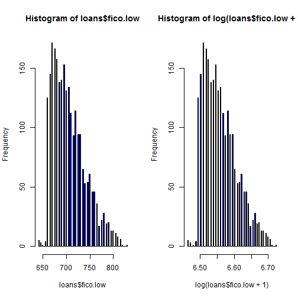
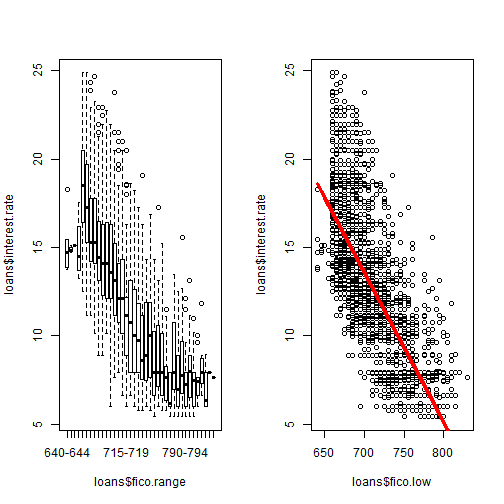

Exploration
========================================================

Obtain data from https://spark-public.s3.amazonaws.com/dataanalysis/loansData.csv


```r
url <- "https://spark-public.s3.amazonaws.com/dataanalysis/loansData.csv"
loansFile = "loansData.csv"
# download.file(url, loansFile, method='curl')
```


Load csv into data.frame.


```r
loans <- read.csv(loansFile)
names(loans)
```

```
##  [1] "Amount.Requested"               "Amount.Funded.By.Investors"    
##  [3] "Interest.Rate"                  "Loan.Length"                   
##  [5] "Loan.Purpose"                   "Debt.To.Income.Ratio"          
##  [7] "State"                          "Home.Ownership"                
##  [9] "Monthly.Income"                 "FICO.Range"                    
## [11] "Open.CREDIT.Lines"              "Revolving.CREDIT.Balance"      
## [13] "Inquiries.in.the.Last.6.Months" "Employment.Length"
```

```r
head(loans)
```

```
##       Amount.Requested Amount.Funded.By.Investors Interest.Rate
## 81174            20000                      20000         8.90%
## 99592            19200                      19200        12.12%
## 80059            35000                      35000        21.98%
## 15825            10000                       9975         9.99%
## 33182            12000                      12000        11.71%
## 62403             6000                       6000        15.31%
##       Loan.Length       Loan.Purpose Debt.To.Income.Ratio State
## 81174   36 months debt_consolidation               14.90%    SC
## 99592   36 months debt_consolidation               28.36%    TX
## 80059   60 months debt_consolidation               23.81%    CA
## 15825   36 months debt_consolidation               14.30%    KS
## 33182   36 months        credit_card               18.78%    NJ
## 62403   36 months              other               20.05%    CT
##       Home.Ownership Monthly.Income FICO.Range Open.CREDIT.Lines
## 81174       MORTGAGE           6542    735-739                14
## 99592       MORTGAGE           4583    715-719                12
## 80059       MORTGAGE          11500    690-694                14
## 15825       MORTGAGE           3833    695-699                10
## 33182           RENT           3195    695-699                11
## 62403            OWN           4892    670-674                17
##       Revolving.CREDIT.Balance Inquiries.in.the.Last.6.Months
## 81174                    14272                              2
## 99592                    11140                              1
## 80059                    21977                              1
## 15825                     9346                              0
## 33182                    14469                              0
## 62403                    10391                              2
##       Employment.Length
## 81174          < 1 year
## 99592           2 years
## 80059           2 years
## 15825           5 years
## 33182           9 years
## 62403           3 years
```


2500 obs. of 14 variables

FICO.Range is expressed as a range, e.g. 695-699
Employment.Length values: < 1 year, 1 year, ...., 10 years, 10+ years

Clean data


```r
lowercols <- function(df) {
    colnames(df) <- tolower(colnames(df))
}
colnames(loans) <- lowercols(loans)
fico.split <- strsplit(as.character(loans$fico.range), "\\-")
loans <- transform(loans, fico.low = as.numeric(sapply(fico.split, "[[", 1)), 
    fico.high = as.numeric(sapply(fico.split, "[[", 2)))
# convert Interest.Rate to numeric
loans$interest.rate <- as.numeric(sub("%", "", loans$interest.rate))
# convert Debt.To.Income.Ration to numeric
loans$debt.to.income.ratio <- as.numeric(sub("%", "", loans$debt.to.income.ratio))
head(loans)
```

```
##       amount.requested amount.funded.by.investors interest.rate
## 81174            20000                      20000          8.90
## 99592            19200                      19200         12.12
## 80059            35000                      35000         21.98
## 15825            10000                       9975          9.99
## 33182            12000                      12000         11.71
## 62403             6000                       6000         15.31
##       loan.length       loan.purpose debt.to.income.ratio state
## 81174   36 months debt_consolidation                14.90    SC
## 99592   36 months debt_consolidation                28.36    TX
## 80059   60 months debt_consolidation                23.81    CA
## 15825   36 months debt_consolidation                14.30    KS
## 33182   36 months        credit_card                18.78    NJ
## 62403   36 months              other                20.05    CT
##       home.ownership monthly.income fico.range open.credit.lines
## 81174       MORTGAGE           6542    735-739                14
## 99592       MORTGAGE           4583    715-719                12
## 80059       MORTGAGE          11500    690-694                14
## 15825       MORTGAGE           3833    695-699                10
## 33182           RENT           3195    695-699                11
## 62403            OWN           4892    670-674                17
##       revolving.credit.balance inquiries.in.the.last.6.months
## 81174                    14272                              2
## 99592                    11140                              1
## 80059                    21977                              1
## 15825                     9346                              0
## 33182                    14469                              0
## 62403                    10391                              2
##       employment.length fico.low fico.high
## 81174          < 1 year      735       739
## 99592           2 years      715       719
## 80059           2 years      690       694
## 15825           5 years      695       699
## 33182           9 years      695       699
## 62403           3 years      670       674
```


fico is left skewed


```r
par(mfrow = c(1, 2))
hist(loans$fico.low, col = "blue", breaks = 100)
hist(log(loans$fico.low + 1), col = "blue", breaks = 100)
```

 


Strong correlation between interest rate and fico
Low fico -> high interest rate
Number of outliers with higher rates


```r
par(mfrow = c(1, 2))
plot(loans$interest.rate ~ loans$fico.range)
lmLow <- lm(loans$interest.rate ~ loans$fico.low)
plot(loans$interest.rate ~ loans$fico.low)
lines(loans$fico.low, lmLow$fitted, col = "red", lwd = 3)
```

 

```r
summary(lmLow)
```

```
## 
## Call:
## lm(formula = loans$interest.rate ~ loans$fico.low)
## 
## Residuals:
##    Min     1Q Median     3Q    Max 
## -7.988 -2.136 -0.455  1.837 10.195 
## 
## Coefficients:
##                Estimate Std. Error t value Pr(>|t|)    
## (Intercept)    72.76547    1.18915    61.2   <2e-16 ***
## loans$fico.low -0.08457    0.00168   -50.3   <2e-16 ***
## ---
## Signif. codes:  0 '***' 0.001 '**' 0.01 '*' 0.05 '.' 0.1 ' ' 1 
## 
## Residual standard error: 2.95 on 2498 degrees of freedom
## Multiple R-squared: 0.503,	Adjusted R-squared: 0.503 
## F-statistic: 2.53e+03 on 1 and 2498 DF,  p-value: <2e-16
```


High F value low P -> strong correlation


```r
anova(lmLow)
```

```
## Analysis of Variance Table
## 
## Response: loans$interest.rate
##                  Df Sum Sq Mean Sq F value Pr(>F)    
## loans$fico.low    1  21937   21937    2527 <2e-16 ***
## Residuals      2498  21689       9                   
## ---
## Signif. codes:  0 '***' 0.001 '**' 0.01 '*' 0.05 '.' 0.1 ' ' 1
```


colnames(loans)
par(mfrow = c(1, 1))

explorereg <- function(df, loanscolumn) {
  plot(df$interest.rate ~ loanscolumn)
  lm1 <- lm(df$interest.rate ~ df$fico.low + loanscolumn)
  summary(lm1)
}

explorereg(loans$debt.to.income.ratio)
explorereg(loans, loans$state)

Some income outliers
Strong correlations when fico is fixed for:
  monthly.income
  employment.length
  inquiries.in.the.last.6.months

summary(loans$monthly.income)
hist(loans$monthly.income, col="blue", breaks=100)
hist(loans$monthly.income[loans$monthly.income < 3e+04], col="blue", breaks=100)
loans.clean <- loans[loans$monthly.income < 3e+04,]
explorereg(loans.clean, loans.clean$monthly.income)  # ***
explorereg(loans, loans$monthly.income)  # ***
explorereg(loans,loans$fico.high)
explorereg(loans,loans$home.ownership) # RENT *
explorereg(loans,loans$open.credit.lines)
explorereg(loans,loans$revolving.credit.balance) # .
explorereg(loans, loans$employment.length) # 10+ years ***
explorereg(loans, loans$inquiries.in.the.last.6.months) # ***
colnames(loans)


