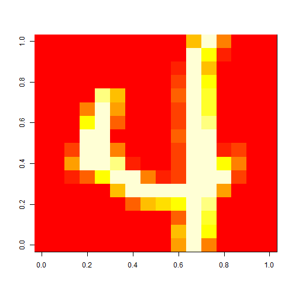

Quiz 3
========================================================

Question 1
----------


```r
library(ElemStatLearn)
data(bone)
plot(bone$age, bone$spnbmd, pch = 19, col = ((bone$gender == "male") + 1))
```

 


This is an exploratory graph because:
* no units on axis labels
* the axis labels are r variables

Question 2
----------


```r
library(ElemStatLearn)
data(marketing)
boxplot(marketing$Income ~ marketing$Marital, col = "grey", xaxt = "n", ylab = "Income", 
    xlab = "")
axis(side = 1, at = 1:5, labels = c("Married", "Living together/not married", 
    "Divorced or separated", "Widowed", "Nevermarried"), las = 2)
```

 


Question 3
----------


```r
library(datasets)
data(iris)
```


Question 4
----------

Question 5
----------


```r
library(ElemStatLearn)
data(zip.train)
```


```r
# Create an image matrix for the 3rd row, which is a 4
im = zip2image(zip.train, 3)
```

```
## [1] "digit  4  taken"
```

```r
image(im)
```

 


