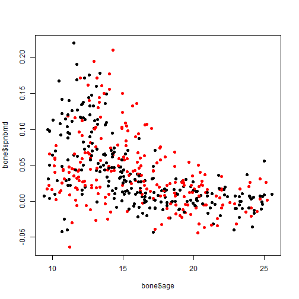
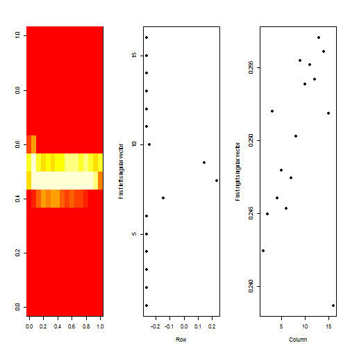
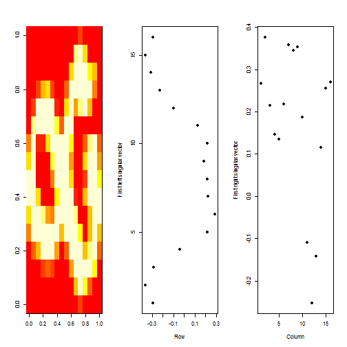

Quiz 3
========================================================

Question 1
----------


```r
library(ElemStatLearn)
data(bone)
plot(bone$age, bone$spnbmd, pch = 19, col = ((bone$gender == "male") + 1))
```

 


This is an exploratory graph because:
* no units on axis labels
* the axis labels are r variables

Question 2
----------


```r
library(ElemStatLearn)
data(marketing)
boxplot(marketing$Income ~ marketing$Marital, col = "grey", xaxt = "n", ylab = "Income", 
    xlab = "")
axis(side = 1, at = 1:5, labels = c("Married", "Living together/not married", 
    "Divorced or separated", "Widowed", "Nevermarried"), las = 2)
```

 


* 75th income widowded ~= 75th income never married
* median income divorced > median income widowed

Question 3
----------


```r
library(datasets)
data(iris)
irisSubset <- iris[, 1:4]
hc <- hclust(dist(irisSubset))
table(cutree(hc, h = 3))
```

```
## 
##  1  2  3  4 
## 50 60 28 12
```

```r
rect.hclust(hc, h = 3)
```

```
## Error: plot.new has not been called yet
```

```r
plot(hc)
```

 


4 clusters at height 3

Question 4
----------
Help on [k-means clustering](http://tinyurl.com/b32nn94)


```r
# read data and subset to x and y columns only
pData <- read.csv("data/quiz3question4.csv")[, 2:3]
plot(pData$x, pData$y, pch = 19, col = "blue")
```

 

```r
# run k-means
km <- kmeans(pData, centers = 2)
# print components of km
print(km)
```

```
## K-means clustering with 2 clusters of sizes 100, 100
## 
## Cluster means:
##         x       y
## 1 -1.7515 -0.5298
## 2  0.1807  0.5589
## 
## Clustering vector:
##   [1] 1 1 1 1 1 1 1 1 1 1 1 1 1 1 1 1 1 1 1 1 1 1 1 1 1 1 1 1 1 1 1 1 1 1 1
##  [36] 1 1 1 1 1 1 1 1 1 1 1 1 1 1 1 1 1 1 1 1 1 1 1 1 1 1 1 1 1 1 1 1 1 1 1
##  [71] 1 1 1 1 1 1 1 1 1 1 1 1 1 2 2 2 2 2 2 2 2 2 2 2 2 2 2 2 2 2 1 1 1 1 1
## [106] 1 1 1 1 1 1 1 1 1 1 1 1 2 2 2 2 2 2 2 2 2 2 2 2 2 2 2 2 2 2 2 2 2 2 2
## [141] 2 2 2 2 2 2 2 2 2 2 2 2 2 2 2 2 2 2 2 2 2 2 2 2 2 2 2 2 2 2 2 2 2 2 2
## [176] 2 2 2 2 2 2 2 2 2 2 2 2 2 2 2 2 2 2 2 2 2 2 2 2 2
## 
## Within cluster sum of squares by cluster:
## [1] 72.17 71.07
##  (between_SS / total_SS =  63.2 %)
## 
## Available components:
## 
## [1] "cluster"      "centers"      "totss"        "withinss"    
## [5] "tot.withinss" "betweenss"    "size"
```

```r
# plot clusters
plot(pData, col = km$cluster)
# plot centers
points(km$centers, col = 1:2, pch = 8)
```

 


* there are two obvious clusters. not all points assigned correctly due to wrapping

Question 5
----------


```r
library(ElemStatLearn)
data(zip.train)
class(zip.train)
```

```
## [1] "matrix"
```

```r
dim(zip.train)
```

```
## [1] 7291  257
```

```r
# first column is the digit represented by the remaining 256 columns
head(zip.train)[, 1]
```

```
## [1] 6 5 4 7 3 6
```


```r
toMatrix <- function(rowN) {
    zip2image(zip.train, rowN)
}
```


```r
m8 <- toMatrix(8)
```

```
## [1] "digit  1  taken"
```

```r
svd8 <- svd(m8)
par(mfrow = c(1, 3))
image(t(m8)[, nrow(m8):1])
plot(svd8$u[, 1], 16:1, , xlab = "Row", ylab = "First left singular vector", 
    pch = 19)
plot(svd8$v[, 1], xlab = "Column", ylab = "First right singular vector", pch = 19)
```

 


```r
m18 <- toMatrix(18)
```

```
## [1] "digit  8  taken"
```

```r
svd18 <- svd(m18)
par(mfrow = c(1, 3))
image(t(m18)[, nrow(m18):1])
plot(svd18$u[, 1], 16:1, , xlab = "Row", ylab = "First left singular vector", 
    pch = 19)
plot(svd18$v[, 1], xlab = "Column", ylab = "First right singular vector", pch = 19)
```

 


```r
par(mfrow = c(1, 2))
plot(svd8$d, xlab = "Column", ylab = "Singluar value", pch = 19)
plot(svd8$d^2/sum(svd8$d^2), xlab = "Column", ylab = "Percent of variance explained", 
    pch = 19)
```

 


```r
par(mfrow = c(1, 2))
plot(svd18$d, xlab = "Column", ylab = "Singluar value", pch = 19)
plot(svd18$d^2/sum(svd18$d^2), xlab = "Column", ylab = "Percent of variance explained", 
    pch = 19)
```

 


