Lecture Notes
========================================================

Data
----

File            | Source
--------------- | ------
samsungData.rda | https://spark-public.s3.amazonaws.com/dataanalysis/samsungData.rda
hunger.csv:     | https://spark-public.s3.amazonaws.com/dataanalysis/hunger.csv
income.csv      | https://spark-public.s3.amazonaws.com/dataanalysis/income.csv
movies.csv      | https://spark-public.s3.amazonaws.com/dataanalysis/movies

Download data files
-------------------


```r
#
# download.file('https://spark-public.s3.amazonaws.com/dataanalysis/samsungData.rda',
# './data/samsungData.rda', method='curl')
# download.file('https://spark-public.s3.amazonaws.com/dataanalysis/hunger.csv',
# './data/hunger.csv', method='curl')
# download.file('https://spark-public.s3.amazonaws.com/dataanalysis/income.csv',
# './data/income.csv', method='curl')
download.file("https://spark-public.s3.amazonaws.com/dataanalysis/movies.txt", 
    "./data/movies.txt", method = "curl")
```


Read data files
---------------


```r
load("./data/samsungData.rda")
hunger <- read.csv("./data/hunger.csv")
income <- read.csv("./data/income.csv")
movies <- read.table("./data/movies.txt", sep = "\t")
```

```
## Warning: number of items read is not a multiple of the number of columns
```


Clustering Example
------------------

Accelerator data from samsung phones collected while performing different activities.

Try and predict what kind of activity a subject is involved in.


```r
names(samsungData)[1:12]
```

```
##  [1] "tBodyAcc-mean()-X" "tBodyAcc-mean()-Y" "tBodyAcc-mean()-Z"
##  [4] "tBodyAcc-std()-X"  "tBodyAcc-std()-Y"  "tBodyAcc-std()-Z" 
##  [7] "tBodyAcc-mad()-X"  "tBodyAcc-mad()-Y"  "tBodyAcc-mad()-Z" 
## [10] "tBodyAcc-max()-X"  "tBodyAcc-max()-Y"  "tBodyAcc-max()-Z"
```

```r
table(samsungData$activity)
```

```
## 
##   laying  sitting standing     walk walkdown   walkup 
##     1407     1286     1374     1226      986     1073
```


Average acceleration for first subject.

i.e. samsungData[samsungData$subject==1,1] is the mean acceleration for the first subject in x-axis
i.e. samsungData[samsungData$subject==1,2] is the mean acceleration for the first subject in y-axis

names(samsungData)[1:3] # first three columns are mean acc x,y,z


```r
par(mfrow = c(1, 2))
numericActivity <- as.numeric(as.factor(samsungData$activity))[samsungData$subject == 
    1]
plot(samsungData[samsungData$subject == 1, 1], pch = 19, col = numericActivity, 
    ylab = names(samsungData)[1])
plot(samsungData[samsungData$subject == 1, 2], pch = 19, col = numericActivity, 
    ylab = names(samsungData)[2])
legend(150, -0.1, legend = unique(samsungData$activity), col = unique(numericActivity), 
    pch = 19)
```

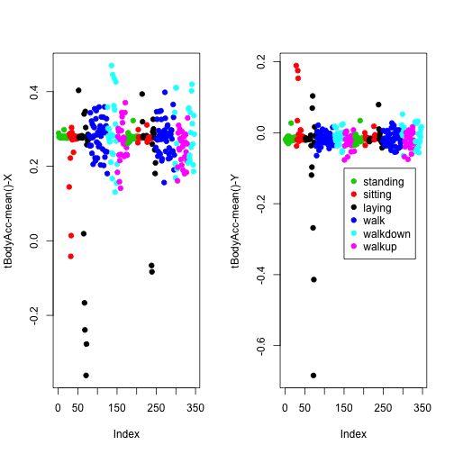 


Clustering base just on average acceleration.

activity does not cluster acceleration very well:


```r
source("http://dl.dropbox.com/u/7710864/courseraPublic/myplclust.R")
distanceMatrix <- dist(samsungData[samsungData$subject == 1, 1:3])
hclustering <- hclust(distanceMatrix)
myplclust(hclustering, lab.col = numericActivity)
```

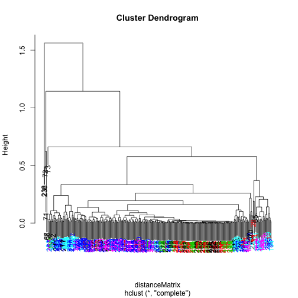 


Plotting max acceleration for the first subject.

Get better clustering based on max acceleration


```r
par(mfrow = c(1, 2))
plot(samsungData[samsungData$subject == 1, 10], pch = 19, col = numericActivity, 
    ylab = names(samsungData)[10])
plot(samsungData[samsungData$subject == 1, 11], pch = 19, col = numericActivity, 
    ylab = names(samsungData)[11])
```

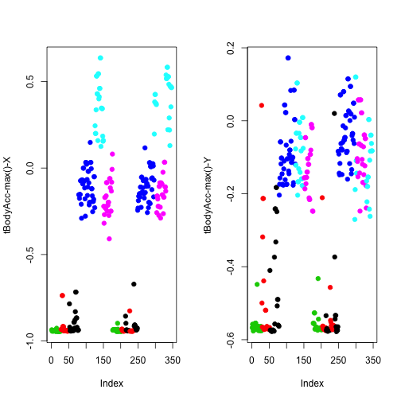 


Clustering based on maximum acceleration

walking down cluster is now well defined


```r
source("http://dl.dropbox.com/u/7710864/courseraPublic/myplclust.R")
distanceMatrix <- dist(samsungData[samsungData$subject == 1, 10:12])
hclustering <- hclust(distanceMatrix)
myplclust(hclustering, lab.col = numericActivity)
```

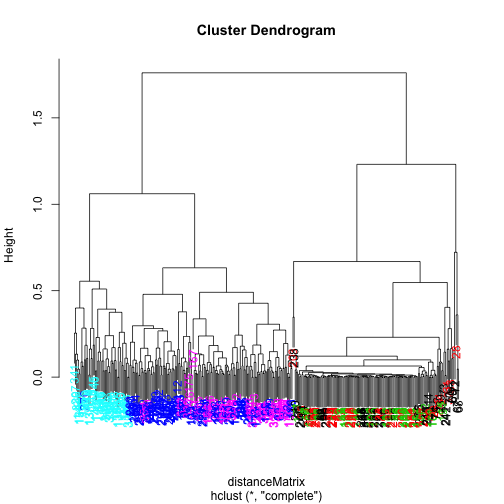 


Singular value decomposition

u  = left singular vector

second singular vector (avg of multiple patterns)


```r
svd1 = svd(scale(samsungData[samsungData$subject == 1, -c(562, 563)]))
par(mfrow = c(1, 2))
plot(svd1$u[, 1], col = numericActivity, pch = 19)
plot(svd1$u[, 2], col = numericActivity, pch = 19)
```

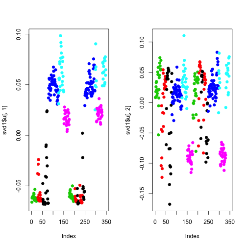 


Find maximum contributor

look at second right singular vector
gives weights that each variable contributes to variation in left singular vector


```r
plot(svd1$v[, 2], pch = 19)
```

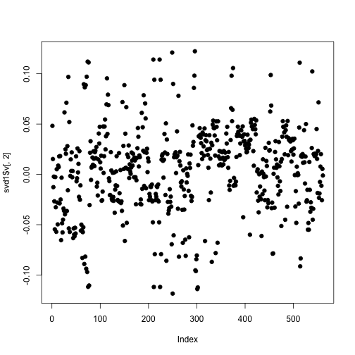 


New clustering with maximum contributer

separates out light blue, blue and pink


```r
maxContrib <- which.max(svd1$v[, 2])
distanceMatrix <- dist(samsungData[samsungData$subject == 1, c(10:12, maxContrib)])
hclustering <- hclust(distanceMatrix)
myplclust(hclustering, lab.col = numericActivity)
```

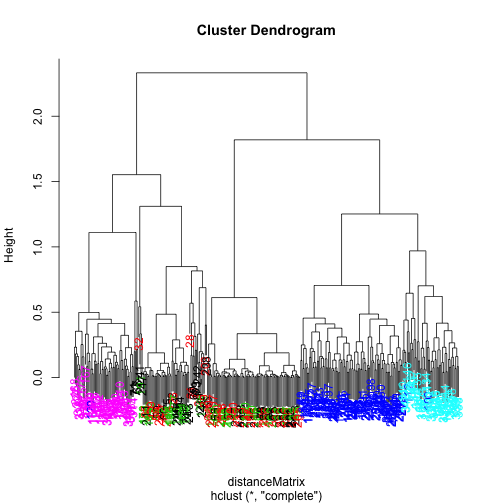 


This is the variable that separates out walking from walking up.


```r
names(samsungData)[maxContrib]
```

```
## [1] "fBodyAcc-meanFreq()-Z"
```


K-means clustering (nstart = 1, first try)


```r
kClust <- kmeans(samsungData[samsungData$subject == 1, -c(562, 563)], centers = 6)
table(kClust$cluster, samsungData$activity[samsungData$subject == 1])
```

```
##    
##     laying sitting standing walk walkdown walkup
##   1      0       0        0    0       26      0
##   2     26      34       48    0        0      0
##   3     19      13        5    0        0      0
##   4      5       0        0    0        0     53
##   5      0       0        0   95        0      0
##   6      0       0        0    0       23      0
```


second try, same parameters. shows clusters still not clear


```r
kClust <- kmeans(samsungData[samsungData$subject == 1, -c(562, 563)], centers = 6, 
    nstart = 1)
table(kClust$cluster, samsungData$activity[samsungData$subject == 1])
```

```
##    
##     laying sitting standing walk walkdown walkup
##   1      0       0        0   50        0      0
##   2     42      45       53    0        0      0
##   3      0       0        0    0       26      0
##   4      8       2        0    0        0     53
##   5      0       0        0    0       23      0
##   6      0       0        0   45        0      0
```


increase attempts to 100, to get better clusters


```r
kClust <- kmeans(samsungData[samsungData$subject == 1, -c(562, 563)], centers = 6, 
    nstart = 100)
table(kClust$cluster, samsungData$activity[samsungData$subject == 1])
```

```
##    
##     laying sitting standing walk walkdown walkup
##   1      0       0        0   95        0      0
##   2      0       0        0    0       49      0
##   3      3       0        0    0        0     53
##   4     18      10        2    0        0      0
##   5     29       0        0    0        0      0
##   6      0      37       51    0        0      0
```


second try with 100 restarts


```r
kClust <- kmeans(samsungData[samsungData$subject == 1, -c(562, 563)], centers = 6, 
    nstart = 100)
table(kClust$cluster, samsungData$activity[samsungData$subject == 1])
```

```
##    
##     laying sitting standing walk walkdown walkup
##   1      3       0        0    0        0     53
##   2     29       0        0    0        0      0
##   3      0       0        0    0       49      0
##   4     18      10        2    0        0      0
##   5      0      37       51    0        0      0
##   6      0       0        0   95        0      0
```


Cluster 1 Variable centers

what do the k-means clusters mean?

Laying:


```r
plot(kClust$center[1, 1:10], pch = 19, ylab = "Cluster Center", xlab = "")
```

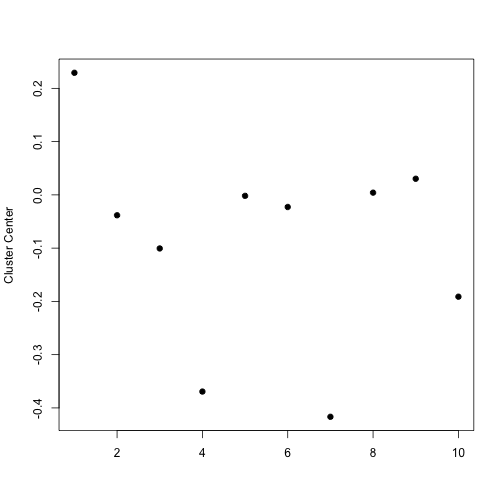 


Walking:


```r
plot(kClust$center[6, 1:10], pch = 19, ylab = "Cluster Center", xlab = "")
```

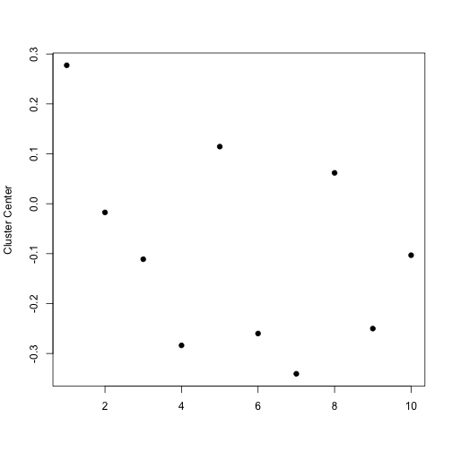 


Basic Least Squares
-------------------

* describe distribution of variables
* describe relationship between variables
* make inferences about distribution and relationships

can you predict the height of the child from the average of the heights of the parents?

Distribution of data:


```r
library(UsingR)
```

```
## Loading required package: MASS
```

```
## Attaching package: 'UsingR'
```

```
## The following object(s) are masked _by_ '.GlobalEnv':
## 
## movies
```

```r
data(galton)
par(mfrow = c(1, 2))
hist(galton$child, col = "blue", breaks = 100)
hist(galton$parent, col = "blue", breaks = 100)
```

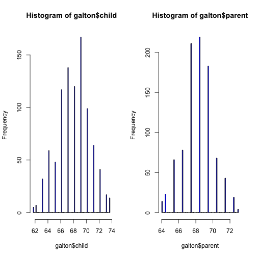 


Distribution of child heights:


```r
hist(galton$child, col = "blue", breaks = 100)
```

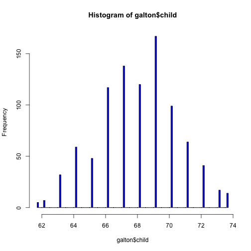 


average child height 

average summarises evenly distributed data


```r
hist(galton$child, col = "blue", breaks = 100)
meanChild <- mean(galton$child)
lines(rep(meanChild, 100), seq(0, 150, length = 100), col = "red", lwd = 5)
```

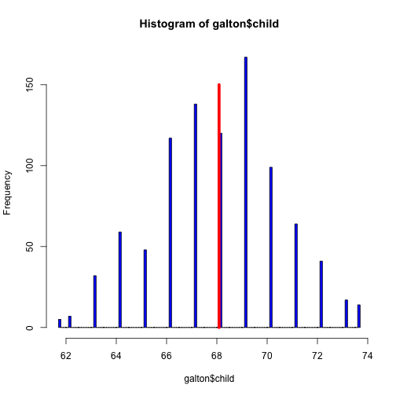 


child vs average parent


```r
plot(galton$parent, galton$child, pch = 19, col = "blue")
```

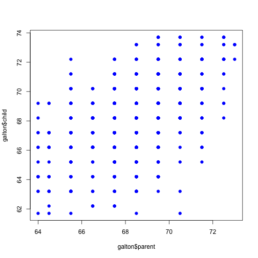 


jittered plot

shows stacked points by adding some random noise to points


```r
set.seed(1234)
plot(jitter(galton$parent, factor = 2), jitter(galton$child, factor = 2), pch = 19, 
    col = "blue")
```

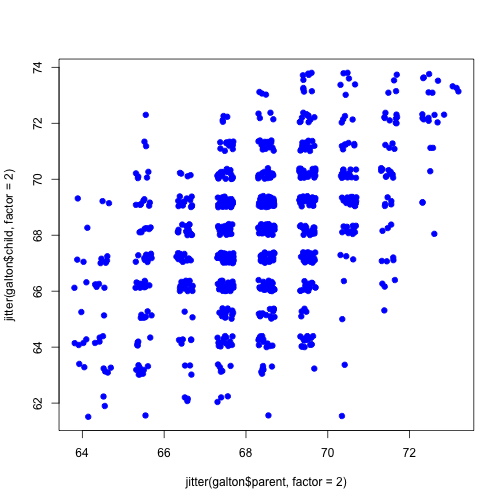 


average parent = 65'' tall


```r
plot(galton$parent, galton$child, pch = 19, col = "blue")
near65 <- galton[abs(galton$parent - 65) < 1, ]
points(near65$parent, near65$child, pch = 19, col = "red")
lines(seq(64, 66, length = 100), rep(mean(near65$child), 100), col = "red", 
    lwd = 4)
```

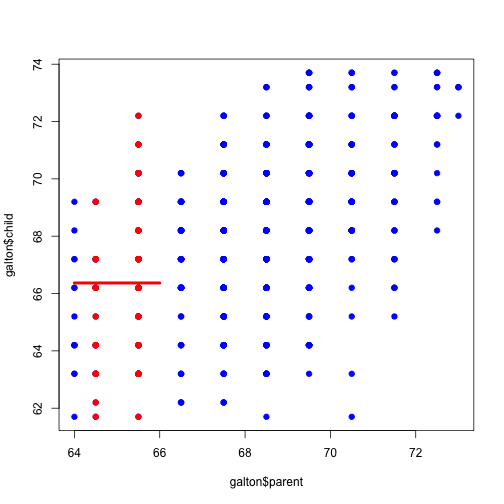 


average parent = 75'' tall


```r
plot(galton$parent, galton$child, pch = 19, col = "blue")
near71 <- galton[abs(galton$parent - 71) < 1, ]
points(near71$parent, near71$child, pch = 19, col = "red")
lines(seq(70, 72, length = 100), rep(mean(near71$child), 100), col = "red", 
    lwd = 4)
```

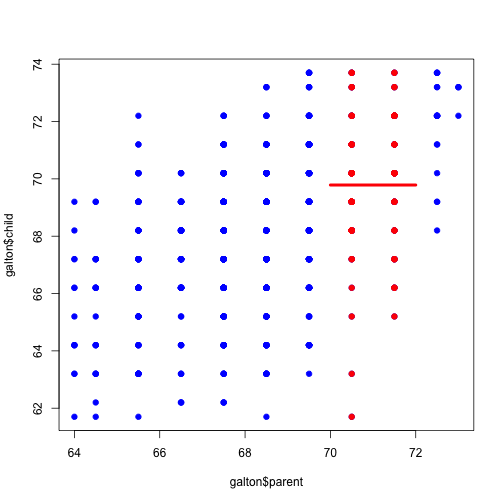 


fit a line to summarize the data using the lm linear model function


```r
plot(galton$parent, galton$child, pch = 19, col = "blue")
lm1 <- lm(galton$child ~ galton$parent)
lines(galton$parent, lm1$fitted, col = "red", lwd = 3)
```

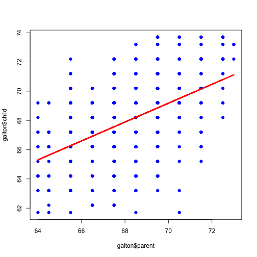 


Not good to just plot this (does not account for error terms)

plot(galton$parent,galton$child,pch=19,col="blue") 
lines(galton$parent, 26 + 0.646*galton$parent)

plot(galton$parent,galton$child,pch=19,col="blue") 
lines(galton$parent,lm1$fitted,col="red",lwd=3)

residuals are differences between best fit and the points


```r
par(mfrow = c(1, 2))
plot(galton$parent, galton$child, pch = 19, col = "blue")
lines(galton$parent, lm1$fitted, col = "red", lwd = 3)
plot(galton$parent, lm1$residuals, col = "blue", pch = 19)
abline(c(0, 0), col = "red", lwd = 3)
```

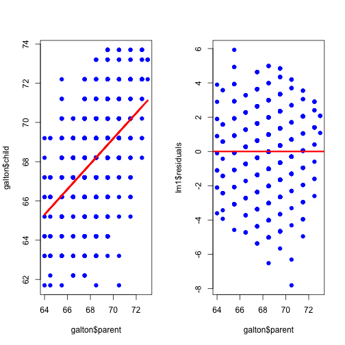 


Inference Basics
----------------

Using galton child and parent height data:

use linear model to fit line


```r
library(UsingR)
data(galton)
plot(galton$parent, galton$child, pch = 19, col = "blue")
lm1 <- lm(galton$child ~ galton$parent)
lines(galton$parent, lm1$fitted, col = "red", lwd = 3)
```

 


The slope and intercept of the line given by:


```r
lm1
```

```
## 
## Call:
## lm(formula = galton$child ~ galton$parent)
## 
## Coefficients:
##   (Intercept)  galton$parent  
##        23.942          0.646
```


Generate a large dataset that follows the galton data


```r
newGalton <- data.frame(parent = rep(NA, 1e+06), child = rep(NA, 1e+06))
newGalton$parent <- rnorm(1e+06, mean = mean(galton$parent), sd = sd(galton$parent))
newGalton$child <- lm1$coeff[1] + lm1$coeff[2] * newGalton$parent + rnorm(1e+06, 
    sd = sd(lm1$residuals))
smoothScatter(newGalton$parent, newGalton$child)
```

```
## KernSmooth 2.23 loaded Copyright M. P. Wand 1997-2009
```

```r
abline(lm1, col = "red", lwd = 3)
```

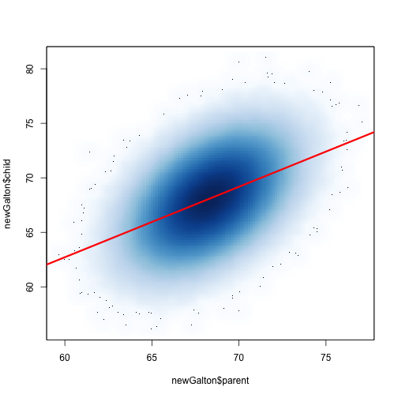 


Sample the data and calculate the best fit


```r
set.seed(134325)
sampleGalton1 <- newGalton[sample(1:1e+06, size = 50, replace = F), ]
sampleLm1 <- lm(sampleGalton1$child ~ sampleGalton1$parent)
plot(sampleGalton1$parent, sampleGalton1$child, pch = 19, col = "blue")
lines(sampleGalton1$parent, sampleLm1$fitted, lwd = 3, lty = 2)
abline(lm1, col = "red", lwd = 3)
```

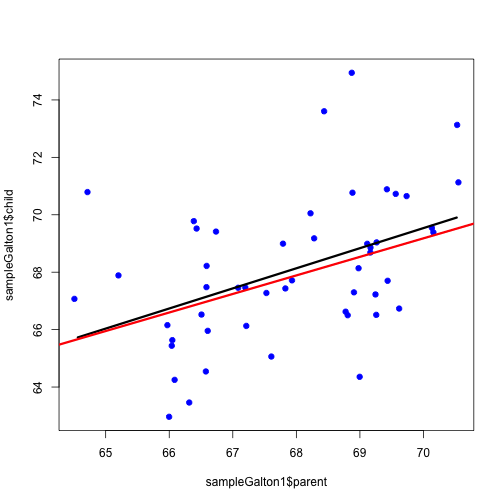 


another sample


```r
sampleGalton2 <- newGalton[sample(1:1e+06, size = 50, replace = F), ]
sampleLm2 <- lm(sampleGalton2$child ~ sampleGalton2$parent)
plot(sampleGalton2$parent, sampleGalton2$child, pch = 19, col = "blue")
lines(sampleGalton2$parent, sampleLm2$fitted, lwd = 3, lty = 2)
abline(lm1, col = "red", lwd = 3)
```

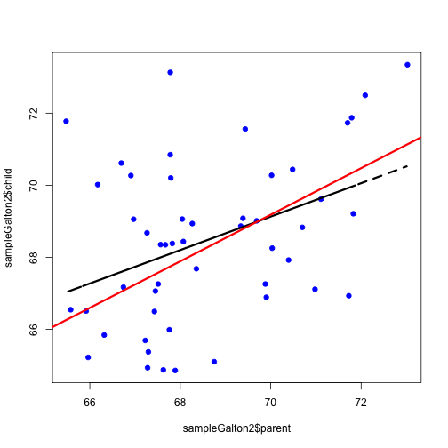 


another sample


```r
sampleGalton3 <- newGalton[sample(1:1e+06, size = 50, replace = F), ]
sampleLm3 <- lm(sampleGalton3$child ~ sampleGalton3$parent)
plot(sampleGalton3$parent, sampleGalton3$child, pch = 19, col = "blue")
lines(sampleGalton3$parent, sampleLm3$fitted, lwd = 3, lty = 2)
abline(lm1, col = "red", lwd = 3)
```

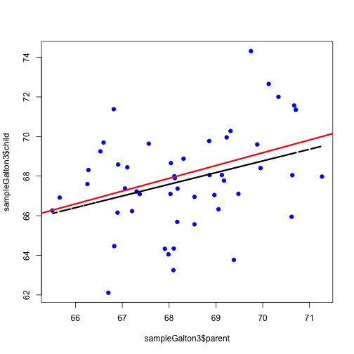 


many samples


```r
sampleLm <- vector(100, mode = "list")
for (i in 1:100) {
    sampleGalton <- newGalton[sample(1:1e+06, size = 50, replace = F), ]
    sampleLm[[i]] <- lm(sampleGalton$child ~ sampleGalton$parent)
}
```


plot against many samples


```r
smoothScatter(newGalton$parent, newGalton$child)
for (i in 1:100) {
    abline(sampleLm[[i]], lwd = 3, lty = 2)
}
abline(lm1, col = "red", lwd = 3)
```

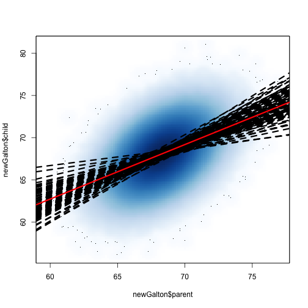 


Histograms show data is centred on the slope and intercept used to generate the data


```r
par(mfrow = c(1, 2))
hist(sapply(sampleLm, function(x) {
    coef(x)[1]
}), col = "blue", xlab = "Intercept", main = "")
hist(sapply(sampleLm, function(x) {
    coef(x)[2]
}), col = "blue", xlab = "Slope", main = "")
```

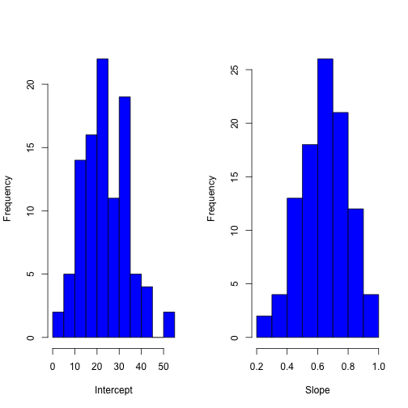 


Central limit theorum

Estimate errors in R


```r
sampleGalton4 <- newGalton[sample(1:1e+06, size = 50, replace = F), ]
sampleLm4 <- lm(sampleGalton4$child ~ sampleGalton4$parent)
summary(sampleLm4)
```

```
## 
## Call:
## lm(formula = sampleGalton4$child ~ sampleGalton4$parent)
## 
## Residuals:
##    Min     1Q Median     3Q    Max 
## -4.391 -1.805 -0.434  1.912  5.966 
## 
## Coefficients:
##                      Estimate Std. Error t value Pr(>|t|)    
## (Intercept)             9.859     13.831    0.71  0.47941    
## sampleGalton4$parent    0.851      0.202    4.22  0.00011 ***
## ---
## Signif. codes:  0 '***' 0.001 '**' 0.01 '*' 0.05 '.' 0.1 ' ' 1 
## 
## Residual standard error: 2.58 on 48 degrees of freedom
## Multiple R-squared: 0.27,	Adjusted R-squared: 0.255 
## F-statistic: 17.8 on 1 and 48 DF,  p-value: 0.000109
```


distribution of slopes


```r
hist(sapply(sampleLm, function(x) {
    coef(x)[2]
}), col = "blue", xlab = "Slope", main = "", freq = F)
lines(seq(0, 5, length = 100), dnorm(seq(0, 5, length = 100), mean = coef(sampleLm4)[2], 
    sd = summary(sampleLm4)$coeff[2, 2]), lwd = 3, col = "red")
```

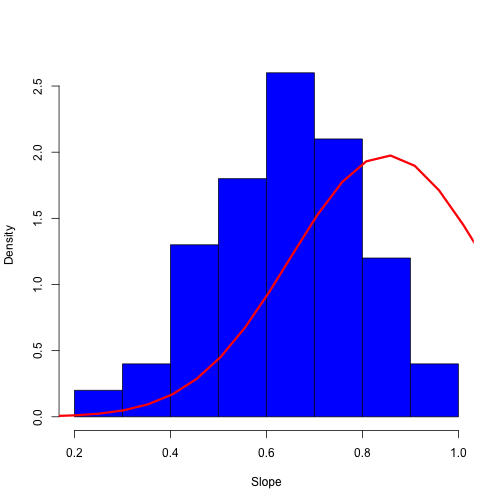 


```r
par(mfrow = c(1, 2))
hist(sapply(sampleLm, function(x) {
    coef(x)[1]
}), col = "blue", xlab = "Intercept", main = "")
hist(sapply(sampleLm, function(x) {
    coef(x)[2]
}), col = "blue", xlab = "Slope", main = "")
```

 


t distributions


```r
x <- seq(-5, 5, length = 100)
plot(x, dnorm(x), type = "l", lwd = 3)
lines(x, dt(x, df = 3), lwd = 3, col = "red")
lines(x, dt(x, df = 10), lwd = 3, col = "blue")
```

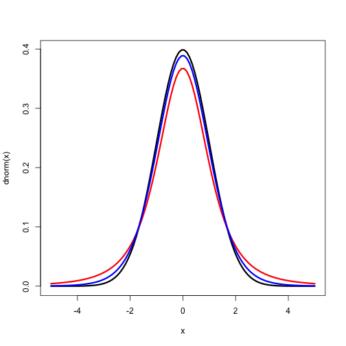 


```r
summary(sampleLm4)$coeff
```

```
##                      Estimate Std. Error t value  Pr(>|t|)
## (Intercept)            9.8590    13.8309  0.7128 0.4794056
## sampleGalton4$parent   0.8515     0.2019  4.2172 0.0001089
```


```r
confint(sampleLm4, level = 0.95)
```

```
##                         2.5 % 97.5 %
## (Intercept)          -17.9499 37.668
## sampleGalton4$parent   0.4455  1.257
```


```r
par(mar = c(4, 4, 0, 2))
plot(1:10, type = "n", xlim = c(0, 1.5), ylim = c(0, 100), xlab = "Coefficient Values", 
    ylab = "Replication")
for (i in 1:100) {
    ci <- confint(sampleLm[[i]])
    color = "red"
    if ((ci[2, 1] < lm1$coeff[2]) & (lm1$coeff[2] < ci[2, 2])) {
        color = "grey"
    }
    segments(ci[2, 1], i, ci[2, 2], i, col = color, lwd = 3)
}
lines(rep(lm1$coeff[2], 100), seq(0, 100, length = 100), lwd = 3)
```

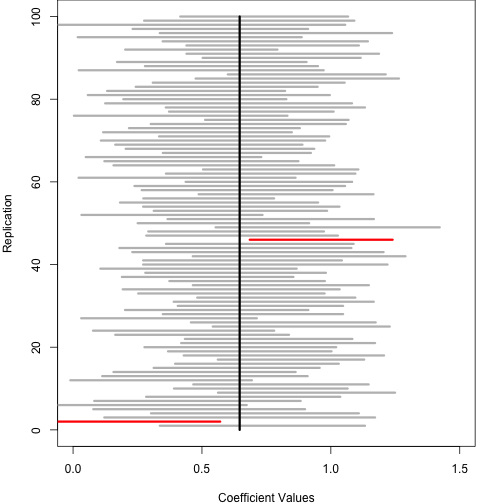 


```r
sampleLm4$coeff
```

```
##          (Intercept) sampleGalton4$parent 
##               9.8590               0.8515
```


```r
confint(sampleLm4, level = 0.95)
```

```
##                         2.5 % 97.5 %
## (Intercept)          -17.9499 37.668
## sampleGalton4$parent   0.4455  1.257
```


