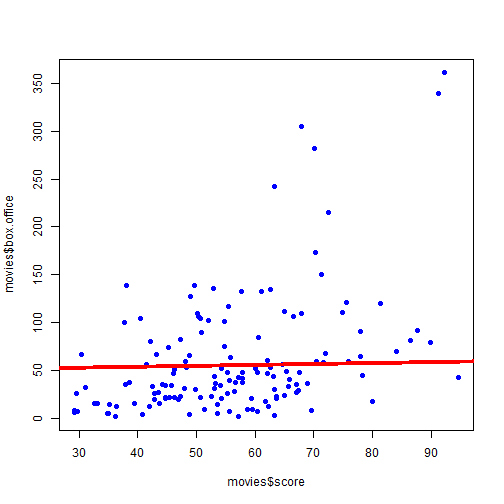

Quiz 4
========================================================

Q1
--


```r
movies <- read.delim("./data/movies.txt", sep = "\t", header = TRUE)
names(movies)
```

```
## [1] "X"            "score"        "rating"       "genre"       
## [5] "box.office"   "running.time"
```

```r
head(movies)
```

```
##                  X score rating            genre box.office running.time
## 1 2 Fast 2 Furious  48.9  PG-13 action/adventure     127.15          107
## 2    28 Days Later  78.2      R           horror      45.06          113
## 3      A Guy Thing  39.5  PG-13       rom comedy      15.54          101
## 4      A Man Apart  42.9      R action/adventure      26.25          110
## 5    A Mighty Wind  79.9  PG-13           comedy      17.78           91
## 6 Agent Cody Banks  57.9     PG action/adventure      47.81          102
```

```r
plot(movies$score, movies$box.office, pch = 19, col = "blue")
lm1 <- lm(movies$score ~ movies$box.office)
lines(movies$box.office, lm1$fitted, col = "red", lwd = 3)
```

 

```r
summary(lm1)
```

```
## 
## Call:
## lm(formula = movies$score ~ movies$box.office)
## 
## Residuals:
##    Min     1Q Median     3Q    Max 
## -26.13  -9.37  -0.13   8.69  40.34 
## 
## Coefficients:
##                   Estimate Std. Error t value Pr(>|t|)    
## (Intercept)        50.0756     1.5406    32.5  < 2e-16 ***
## movies$box.office   0.0968     0.0176     5.5  1.8e-07 ***
## ---
## Signif. codes:  0 '***' 0.001 '**' 0.01 '*' 0.05 '.' 0.1 ' ' 1 
## 
## Residual standard error: 13.1 on 138 degrees of freedom
## Multiple R-squared: 0.18,	Adjusted R-squared: 0.174 
## F-statistic: 30.2 on 1 and 138 DF,  p-value: 1.8e-07
```


Intercept: 50.07559
Slope: 0.09676

The regression coefficient is 0.09676. The interpretation is that an increase of one million dollars in box office gross is associated with a 0.09676 increase in Rotten Tomatoes Score.

Q2
--


```r
movies <- read.delim("./data/movies.txt", sep = "\t", header = TRUE)
plot(movies$score, movies$box.office, pch = 19, col = "blue")
lm1 <- lm(movies$score ~ movies$box.office)
lines(movies$box.office, lm1$fitted, col = "red", lwd = 3)
```

 

```r
summary(lm1)
```

```
## 
## Call:
## lm(formula = movies$score ~ movies$box.office)
## 
## Residuals:
##    Min     1Q Median     3Q    Max 
## -26.13  -9.37  -0.13   8.69  40.34 
## 
## Coefficients:
##                   Estimate Std. Error t value Pr(>|t|)    
## (Intercept)        50.0756     1.5406    32.5  < 2e-16 ***
## movies$box.office   0.0968     0.0176     5.5  1.8e-07 ***
## ---
## Signif. codes:  0 '***' 0.001 '**' 0.01 '*' 0.05 '.' 0.1 ' ' 1 
## 
## Residual standard error: 13.1 on 138 degrees of freedom
## Multiple R-squared: 0.18,	Adjusted R-squared: 0.174 
## F-statistic: 30.2 on 1 and 138 DF,  p-value: 1.8e-07
```

```r
confint(lm1, level = 0.9)
```

```
##                        5 %    95 %
## (Intercept)       47.52438 52.6268
## movies$box.office  0.06762  0.1259
```


The 90% confidence interval for the intercept is (47.52, 52.63). If we repeated this study 100 times, we would expect our calculated interval to cover the true value on average 90% of the time.

Q3
--


```r
movies <- read.delim("./data/movies.txt", sep = "\t", header = TRUE)
par(mfrow = c(1, 1))
lmBoth <- lm(movies$score ~ movies$box.office + movies$running.time)
summary(lmBoth)
```

```
## 
## Call:
## lm(formula = movies$score ~ movies$box.office + movies$running.time)
## 
## Residuals:
##    Min     1Q Median     3Q    Max 
## -29.29  -8.82  -0.36   8.54  40.80 
## 
## Coefficients:
##                     Estimate Std. Error t value Pr(>|t|)    
## (Intercept)          37.2364     5.6057    6.64  6.7e-10 ***
## movies$box.office     0.0824     0.0183    4.50  1.5e-05 ***
## movies$running.time   0.1275     0.0536    2.38    0.019 *  
## ---
## Signif. codes:  0 '***' 0.001 '**' 0.01 '*' 0.05 '.' 0.1 ' ' 1 
## 
## Residual standard error: 12.9 on 137 degrees of freedom
## Multiple R-squared: 0.212,	Adjusted R-squared: 0.201 
## F-statistic: 18.5 on 2 and 137 DF,  p-value: 7.98e-08
```

running.time coeff 0.12752

The coefficient is 0.12752. That means that if two movies have the same box office gross, an increase of one minute in running time is associated with an average increase of 0.12752 in score.

Q4
--

Q5
--

Q6
--

Q7
--

Q8
--

Q9
--

Q10
---


